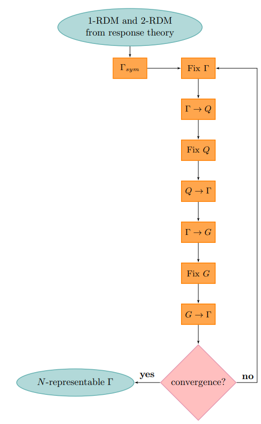
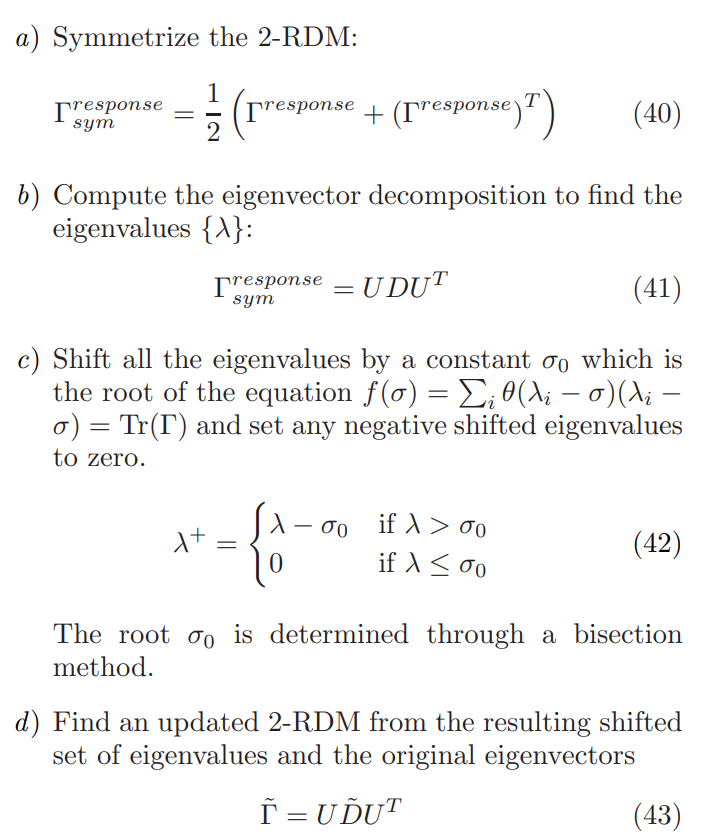

# Quantum error mitigation using N-representability of 2-RDM

The 2-RDMs from response theory are not N-representable. That is, the response 2-RDM does not correspond to an actual physical N-electron wave function. 

[Lanssens et al.][1] presents a new method making these non-N-representable 2-RDMs approximately N-representable in *Method For Making 2-Electron Response Reduced Density Matrices Approximately N-representable*.

This program is the implementation of the method in this paper and obtains good performance.

## Procedure

See FIG.1 of the [paper][1].



This is implemented in [NRepresentabiliy.optimize](./NRepresentability.py).

### Fix 2-RDM

See from Equation.40 to Equation.43 of the [paper][1].



This is implemented in [NRepresentabiliy.fix_two_rdm](./NRepresentability.py).

## Requirements

See [requirements.txt](./requirements.txt).

This program uses PySCF for calculating energy. Installation of PySCF see [here][5].

P.S. `rdm_mapping_functions.py` is copied from [OpenFermion][2] without any modification. You can install OpenFermion and import the functions in `rdm_mapping_functions.py` instead. See [docs of OpenFermion][3].

## Usage

Copy `NRepresentability.py` (and `rdm_mapping_functions.py` if you do not install OpenFermion) to your program.

Refer to [error_mitigation.py](./error_mitigation.py) for the usage. Here are some explanations.

### 0. Generate ideal and noisy 2-RDM from your ansatz

2-RDM is a 4-dimensional numpy.ndarray.

Let's assume they are stored in `ideal_rdm, noisy_rdm`.

### 1. Use `NRepresentability` to get approximately N-representable 2-RDM

See [./error_mitigation.py](./error_mitigation.py):

```python
nrep = NRepresentability(
        num_spin_orbital=num_spin_orbitals,
        num_particle=num_particles,
        two_particle_rdm_ideal=ideal_rdm,
        two_particle_rdm_noisy=noisy_rdm
      )
      
nrep.optimize()

# the optimized 2rdm is saved in nrep.two_particle_rdm_optimized
```

### 2. Calculate energy using 2-RDM
        
Calculate energe from 2-RDM and 1-RDM, according to Equation A14 in the Google's famous [Hartree Fork paper](4).

The method of obtaining $ h_{ij} $ and $ V_{ijkl} $ refers to [stackexchange](https://mattermodeling.stackexchange.com/questions/4284/how-are-1-electron-and-2-electron-integrals-done-in-pyscf).

The whole procedure refers to [`get_energy`](./error_mitigation.py) function.

### 3. Result

```
1-qubit and 2-qubit gate error rate:  0.005 0.01
trace of ideal and noisy 2-RDM:  12.00156146577284 13.862
fidelity and norm distance before error mitigation:  22.5801569246888 0.733351165091072
fidelity and norm distance after error mitigation:  21.587536213113708 0.5774721548336637
trace of error-mitigated 2-RDM:  12.000000000000004
converged SCF energy = -1.40975299670212
converged SCF energy = -1.40975299670212
converged SCF energy = -1.40975299670212
Energy calculation with ideal 2-RDM, noisy 2-RDM, and error-mitigated 2-RDM:  -3.701272225045865 -4.2769176286551955 -3.701140476126008
```

P.S. Since the 2-RDM provided in `./2rdm_array_data` is generated from an ansatz which is not optimized, the energy of the noisy 2-RDM is lower than that of ideal one.

As you see, the trace error optimized from 13.862 to 12, while energy optimized from -4.27 to -3.70.

## To Do

1. release the code of generating 2-RDM
2. release the code of calculating energy from 2-RDM
3. embedding this program into some existing quantum error mitigation module

Since (1) and (2) might release some of our research idea, so we do not release them at now.

## References

- [1]: https://arxiv.org/pdf/1707.01022 "Method For Making 2-Electron Response Reduced Density Matrices Approximately N-representable"
- [2]: https://github.com/quantumlib/OpenFermion/blob/master/src/openfermion/utils/rdm_mapping_functions.py "Mapping between different kinds of RDMs"
- [3]: https://github.com/quantumlib/OpenFermion "GitHub repository of OpenFermion"
- [4]: https://arxiv.org/pdf/2004.04174 "Hartree-Fock on a superconducting qubit quantum computer"
- [5]: https://github.com/pyscf/pyscf "PySCF GitHub Repository"
        